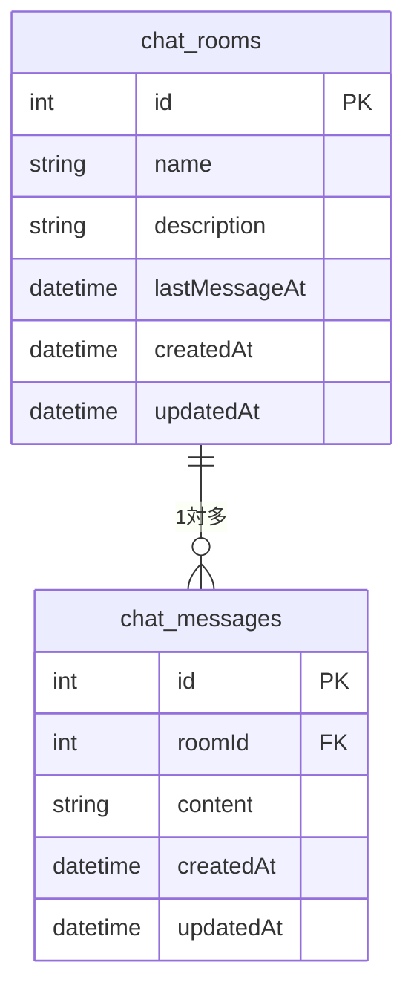
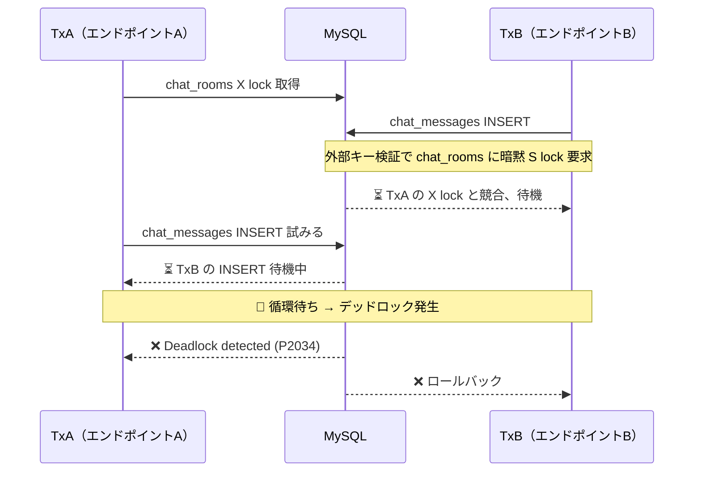
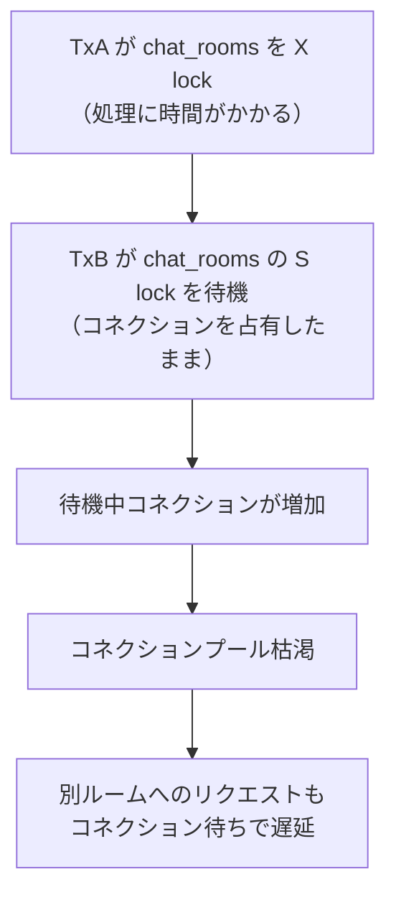
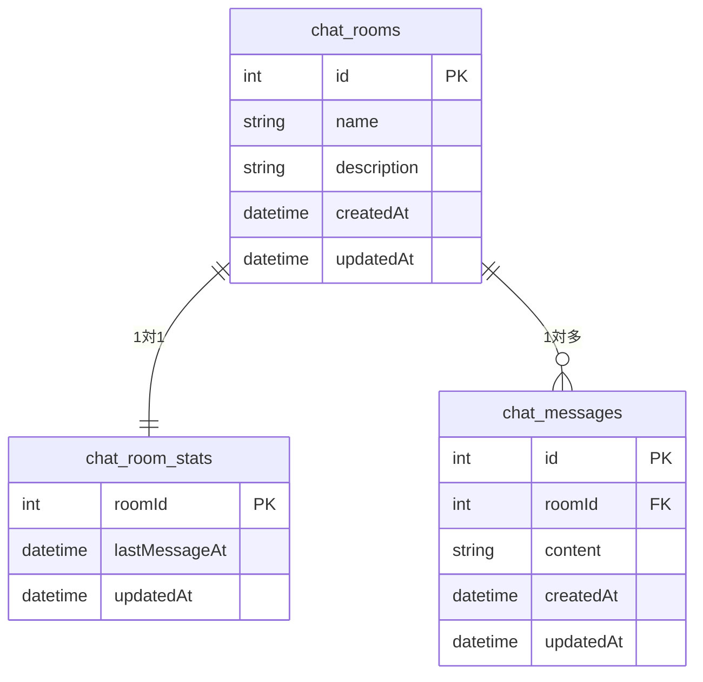
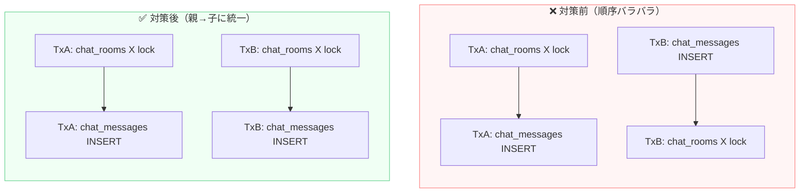
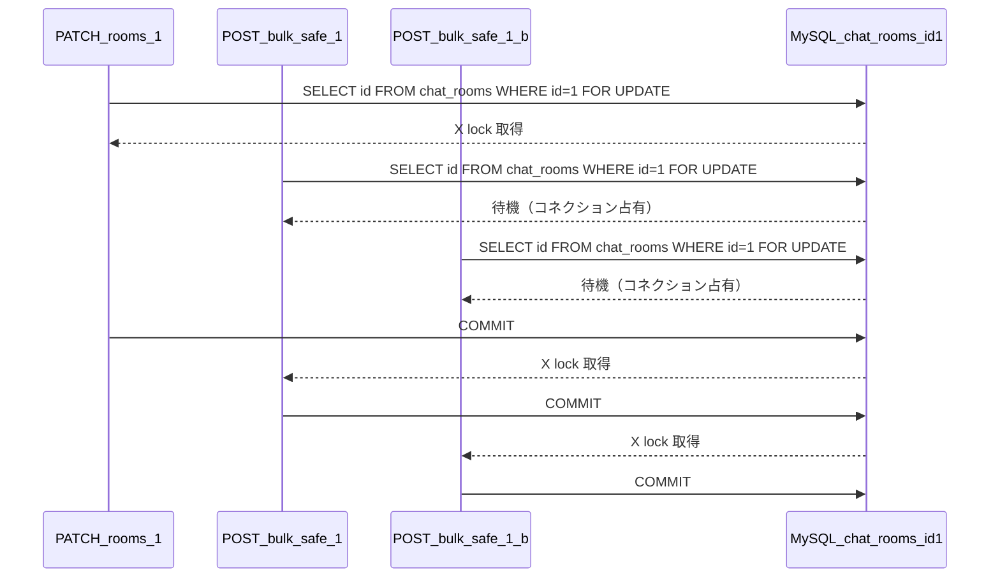
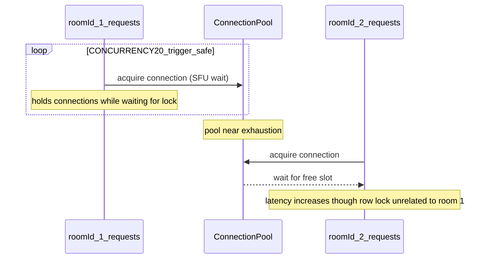

## 対象読者
- RDBを使ったバックエンドアプリケーションを開発しているエンジニア
- 「本番で断続的にデッドロックエラーが出るが原因が分からない」という状況に直面している人
- 外部キー制約があるテーブル設計でトランザクションを書く機会がある人

## いいね！してね
この記事の事例は必要に応じて今後追記していく予定です！
「新しい事例が知りたい」「他の事例も知りたい」と思った人は、ぜひこの記事にいいね👍してください。筆者のモチベーションにつながります！

Xで情報発信しているのでフォローお願いします！ [@rsugi8](https://x.com/rsugi8)

それでは以下が本編です。

---

## この記事で分かること
- 外部キー制約がある親子テーブルでデッドロックが起きる仕組み
- `INSERT` だけで親テーブルにロックがかかる理由（暗黙の S lock）
- デッドロックを防ぐための対策（ロック順序統一・SELECT FOR UPDATE・リトライ）
- SELECT FOR UPDATE の副作用（レイテンシ増加・コネクションプール枯渇）

# 本番で断続的に 500 エラーが出た

ある日、本番環境で断続的に 500 エラーが出始めました。ログに残っていたのは「deadlock detected」の文字だけで、コードを見てもとくに怪しい箇所は見当たりません。まずは、このエラーが起きたシステムの構成から振り返ってみます。

## 作っていたもの：問い合わせ対応アプリ
- ユーザーが問い合わせを投稿すると、botが自動返答する
- 1回の返答数は最大5個
- chat_rooms（スレッド）と chat_messages（メッセージ）の2テーブル構成
- chat_roomsには「最終メッセージ日時」を保存する
- メッセージ投稿時に lastMessageAt を更新する仕様



シンプルな 2 テーブル構成に見えますが、このような設計にはデッドロックの落とし穴が潜んでいます。

## このテーブル構造、よく見かけませんか？

このような「親テーブルに集計・サマリー・記録系カラムを持たせる」設計は、どのサービスでも自然に生まれやすいです。

**なぜ作りがちか：**

- 1対多リレーション + 外部キーは DB 設計の基本であり、正規化として正しく見える
- `lastMessageAt` を親テーブルに持たせると `ORDER BY lastMessageAt DESC` で JOIN なしに一覧ソートができ、シンプルかつ合理的に見える
- 設計時点では「トランザクションで、子テーブルへの INSERT と同時に親テーブルも更新する」というイメージ

**同じ構造が現れがちなパターン：**

| サービス | 親テーブル | 子テーブル | 問題カラムの例 |
|----------|-----------|-----------|--------------|
| チャット・問い合わせ | rooms / threads | messages | lastMessageAt |
| EC | orders | order_items | totalAmount, updatedAt |
| タスク管理 | projects | tasks | lastActivityAt |
| SNS | posts | comments / likes | commentCount, likeCount |

共通するのは「**子テーブルへの操作に連動して毎回親テーブルも更新する集計系カラム**」です。このカラムが親テーブルにある限り、アクセスが増えた瞬間にデッドロックの火種になります。

共通パターンをまとめると：

- タイムスタンプ系 — lastXxxAt（最終〇〇日時）
- カウント系 — xxxCount（件数の denormalization）
- 集計値系 — totalAmount, totalSize（合計値の denormalization）

このような設計がどういった操作の組み合わせでデッドロックを起こすのか、次はデモ API のエンドポイント構成とともに見てみます。

## デッドロックが発生した操作パターン

本デモ API のエンドポイント一覧。`sleepMs` はロックを長時間保持するための意図的な遅延パラメータで、デッドロックを再現しやすくするために使っています。「危険版」はロック取得順序が子→親になっているもの、「安全版」は親→子に修正したものです。

| エンドポイント | 役割 | デッドロックリスク |
|---------------|------|-----------------|
| `POST   /rooms` | ルーム作成 | 低 |
| `PATCH  /rooms/:id` | ルーム属性更新（先頭で `SELECT ... FOR UPDATE` で親をロックするが、他エンドポイントと組み合わせると循環待ちが発生する、`sleepMs` はロック取得後に保持） | 高 |
| `POST   /messages/bulk` | メッセージ複数作成（子→親順：危険版） | 高 |
| `POST   /messages/bulk-safe` | メッセージ複数作成（親→子順：安全版） | 低 |
| `POST   /deadlock/trigger` | デッドロックを意図的に再現 | 確実に発生 |
| `POST   /deadlock/trigger-safe` | ロック順序修正済み（比較用） | 発生しない |

高リスクな操作が同じルームに重なったとき、影響はそのルームだけにとどまりませんでした。

## なぜか無関係なルームへのリクエストまで遅くなった

デッドロックが起きているルームとは別のルームへのリクエストが、なぜか遅くなっていました。ロックは行単位のはずなのに、なぜ無関係なリクエストまで影響を受けるのでしょうか。詳しくは「なぜ起きたのか」の節で説明しますが、原因はコネクションプールにあります。

# tl;dr
- **根本原因：** 更新頻度の高いカラム（lastMessageAt）が親テーブルにある設計
- 外部キー制約があると INSERT だけで親テーブルに暗黙の S lock がかかる
- ロック取得順序がバラバラだとデッドロックする
- **対症療法（今すぐできる）：** 親→子の順で統一 ＋ SELECT FOR UPDATE ＋ リトライ
- ただし SELECT FOR UPDATE はレイテンシ増加・コネクションプール枯渇の副作用あり
- **根本解決（中長期）：** 更新頻度の高いカラムを別テーブルに分離する
- ただし、テーブルが運用フェーズに乗ってからの設計変更は影響範囲が大きく、後回しにされがち — 設計時点で「このカラムは高頻度で更新されるか」を意識しておくと将来の負債を減らしやすい

ここからは、それぞれの原因と対策を順に詳しく見ていきます。

# デッドロックの原因：外部キーの暗黙ロックとロック順序

デッドロックは偶然起きたわけではありません。「外部キーによる暗黙のロック」と「ロック取得順序の不統一」という 2 つの原因が重なって引き起こされていました。それぞれを順に見ていきます。

## INSERT しただけなのに親テーブルがロックされる（外部キーの暗黙 S lock）
MySQL InnoDB のデフォルトの挙動で、外部キー制約のある子テーブルに INSERT すると親テーブルへ暗黙の S lock がかかります。

```sql
-- Prisma のコードに書いていないのに MySQL が内部で自動実行する
SELECT id FROM chat_rooms WHERE id = ? LOCK IN SHARE MODE
```

:::details 補足：LOCK IN SHARE MODE（共有ロック）とは
`LOCK IN SHARE MODE` は対象行に**共有ロック（S lock）**をかけながら読み取る命令。
通常の `SELECT` は MVCC（Multi-Version Concurrency Control）の仕組みにより、トランザクション開始時点のスナップショット（過去の版）を読むため、他トランザクションが同じ行を UPDATE・DELETE していても影響を受けない。
一方 `LOCK IN SHARE MODE` は**現在の実際のデータを読み、かつ他トランザクションによる UPDATE・DELETE をブロック**する。

| | 読むデータ | 他からの書き込み |
|---|---|---|
| 通常の `SELECT` | スナップショット（開始時点の版） | ブロックしない |
| `LOCK IN SHARE MODE`（今回） | 現在の最新データ | ブロックする |

共有ロック同士は共存できるため、複数のトランザクションが同じ行に `LOCK IN SHARE MODE` を取得した後、それぞれが排他ロック（`FOR UPDATE`）へ昇格しようとすると互いに相手のロック解除を待ち続け、デッドロックが発生する。
:::

| 子テーブルへの操作 | 親テーブルへの暗黙 S lock |
|-------------------|--------------------------|
| INSERT | **かかる**（親行の存在確認） |
| 外部キーカラム（roomId）を変更する UPDATE | **かかる**（新しい親行の存在確認） |
| 外部キー以外のカラムのみ UPDATE | かからない |
| DELETE | かからない |

**この問題は非常に気づきにくい：**

- 暗黙の S lock はコードに現れない — Prisma にも SQL にも一切書いていない
- 開発・テスト時は並列アクセスが少なく条件が揃わないため再現しない
- サービス成長でアクセスが増えて初めて「たまに 500 エラーが出る」として顕在化する
- 「deadlock detected」というログだけでは根本原因の特定が難しい

:::details エラーログ例（Prisma）
```
PrismaClientKnownRequestError:
Transaction failed due to a write conflict or a deadlock. Please retry your transaction

Code: P2034
```
:::

| 段階 | 状況 | デッドロック発生 |
|------|------|----------------|
| 開発・テスト時 | 並列アクセスほぼなし | 発生しない |
| ローンチ直後 | ユーザー少、アクセス分散 | まれに発生（見過ごされる） |
| 成長期 | ユーザー増、同一ルームに集中 | **頻発し始める** |
| bot 導入後 | ユーザー投稿 + bot 返答が同時 | **確実に発生** |

つまり「**問題のあるコードが本番にデプロイされてから、デッドロックが頻発するまで数ヶ月〜数年かかる**」ケースもありえます。

こうして暗黙の S lock が発生する仕組みがある中で、さらにロックを取る順番が不統一だったことが、デッドロックの直接的な引き金になりました。

## ロックを取る順番がバラバラだった（直接原因）

2 つのトランザクションが互いに相手のロック解除を待ち合う「循環待ち」が、デッドロックの正体です。図でその流れを確認してみましょう。



```
TxA（エンドポイントA）: chat_rooms を X lock → chat_messages を INSERT
TxB（エンドポイントB）: chat_messages を INSERT → chat_rooms を X lock
```

ロック順序の問題がデッドロックを生むことはわかりました。さらに、このデッドロックがコネクションプールを圧迫することで、無関係なリクエストにまで影響が波及していきます。

## 関係ないリクエストまで遅くなる（コネクションプールへの波及）



ロックは行単位ですが、コネクションはプール全体で共有されるリソースです。待機中のトランザクションがコネクションを占有し続けることで、全く別のルームへのリクエストも含めて API 全体のレスポンスが遅延します。

| 原因 | 影響範囲 |
|------|---------|
| ロック取得順序の不統一 | 同一ルームへのリクエスト間でデッドロック発生 |
| 外部キーによる暗黙 S lock | INSERT だけでもルーム UPDATE と競合 |
| コネクションプールの枯渇 | 無関係なルームへのリクエストにも遅延波及 |

原因が 3 つの層に分かれていることがわかりました。それぞれに対してどう対処するか、次のセクションで整理します。

# デッドロック対策：ロック順序統一・SELECT FOR UPDATE・リトライ

対策には「根本解決」と「対症療法」があります。根本解決はテーブル設計の変更を伴うため影響範囲が広く、すぐには手をつけにくいことも多いです。まず今すぐできる対症療法を組み合わせながら、中長期で根本を直していくのが現実的なアプローチです。

## テーブル構造を見直す（根本解決）

lastMessageAt を chat_room_stats テーブル（別テーブル）に分離すれば、親テーブル（chat_rooms）はメッセージ投稿で更新されなくなり、ロック競合が構造レベルで解消されます。



- `chat_room_stats.roomId` は `chat_rooms.id` を参照する主キー兼外部キー（1 ルーム 1 行）
- 更新頻度の高い `lastMessageAt` は `chat_room_stats` 側のみが変更対象となり、`chat_rooms` 本体行はメッセージ投稿のたびに UPDATE されない想定

**ただし、現実的にはこの対策を採用できないことが多い：**

- 頻繁にアクセスされ、データ量が多いテーブルほどこの問題が起きやすい
- そのようなテーブルは既存コードやクエリへの影響範囲が大きく、変更が容易でない
- マイグレーションのリスク・工数を考慮すると「変更しない」と決定する可能性が高い

そのため、以下の対症療法と併用するのが現実的です。

| 優先度 | 対策 | 効果 |
|--------|------|------|
| 🔴 今すぐ | ロック取得順序の統一 | デッドロック頻度が激減 |
| 🔴 今すぐ | リトライ実装 | 残ったデッドロックをカバー |
| 🟡 ユースケース次第 | SELECT FOR UPDATE | 順序をコードレベルで強制 |
| 🟢 中長期 | テーブル切り出し | 競合を構造レベルで解消（根本原因の解消） |

## 対策1: ロック取得順序を親→子に統一する

ロックの順序を「常に親→子」に統一するだけで、循環待ちの構造をなくせます。コード上の変更は小さいですが、効果は大きいです。



```typescript
// ❌ before — 子→親の順（TxB がデッドロックしやすい）
await prisma.$transaction(async (tx) => {
  await tx.chatMessage.createMany({ data: messages }) // 外部キー検証で親に暗黙 S lock
  await tx.chatRoom.update({
    where: { id: roomId },
    data: { lastMessageAt: new Date() },
  }) // 親を X lock
})
```

```typescript
// ✅ after — 親→子の順
await prisma.$transaction(async (tx) => {
  await tx.chatRoom.update(...)        // 親を先にロック
  await tx.chatMessage.createMany(...) // 子を後にロック
})
```

ただし、ロック順序を統一するだけでは、別のエンドポイントとの組み合わせによる競合がまだ残ります。それを明示的に防ぐのが SELECT FOR UPDATE です。

## 対策2: SELECT FOR UPDATE で明示的にロックを取得する

トランザクションの先頭で親テーブルを `SELECT ... FOR UPDATE` することで、ロック取得のタイミングをコード上に明示できます。暗黙の S lock 任せにせず、意図してロック順序を制御できるのがポイントです。

ロック順序を統一するだけでは、「メッセージ投稿のみで親テーブルを直接 UPDATE しないエンドポイント」と「ルーム属性を UPDATE するエンドポイント」が同時に動いたときの競合をカバーしきれません。SFU を加えることで、どのエンドポイントでも必ず親を先にロックするパターンを強制できます。

```typescript
// ❌ before — 親への明示ロックなし（暗黙の S lock 任せ）
await prisma.$transaction(async (tx) => {
  await tx.chatMessage.createMany({ data: messages })
  await tx.chatRoom.update({
    where: { id: roomId },
    data: { lastMessageAt: new Date() },
  })
})
```

```typescript
// ✅ after — 先に親を SELECT FOR UPDATE
await prisma.$transaction(async (tx) => {
  await tx.$queryRaw`
    SELECT id FROM chat_rooms WHERE id = ${roomId} FOR UPDATE
  `
  await tx.chatMessage.createMany({ data: messages })
  await tx.chatRoom.update({
    where: { id: roomId },
    data: { lastMessageAt: new Date() },
  })
})
```

順序制御でデッドロックの頻度は大きく下がりますが、タイミング次第でまれに起きることは残ります。そのための保険がリトライです。

## 対策3: デッドロック検知時のリトライ処理を実装する

デッドロックを検知したとき、すぐにエラーを返すのではなく、少し待ってから再試行することで、ユーザーへのエラー露出を最小限に抑えられます。

```typescript
// ❌ before — リトライなし（P2034 でそのまま失敗）
await prisma.$transaction(async (tx) => {
  // ...
})
```

```typescript
// ✅ after — withRetry（`src/lib/retry.ts`）

export async function withRetry<T>(fn: () => Promise<T>, retries = 3, delayMs = 50): Promise<T> {
  for (let i = 0; i < retries; i++) {
    try {
      return await fn()
    } catch (e: unknown) {
      const isDeadlock =
        (e as { code?: string })?.code === 'P2034' ||
        (e as { message?: string })?.message?.includes('Deadlock') ||
        (e as { message?: string })?.message?.includes('deadlock')

      if (isDeadlock && i < retries - 1) {
        console.warn(
          `[Retry] デッドロック検知 (${i + 1}/${retries})、${delayMs * (i + 1)}ms後にリトライ`,
        )
        await new Promise((r) => setTimeout(r, delayMs * (i + 1)))
        continue
      }
      throw e
    }
  }
  throw new Error('Retry failed')
}
```

**リトライのメリット：**

- デッドロックが発生してもユーザーにエラーを見せずに透過的に回復できる
- 実装が軽量で、既存のトランザクション処理を大きく変えなくてよい
- デッドロック時点で DB は被害側トランザクションを自動ロールバックしているため、再試行しても二重書き込みにならない（安全に再実行できる）

**リトライのデメリット・注意点：**

- **メッセージの順序がずれることがある**　— MySQL の auto_increment は ロールバックしても巻き戻らないため、リトライで取得したIDが後続処理のIDより大きくなる場合がある。また、リトライ時に `new Date()` を再評価すると `createdAt` も遅れる。結果として「ユーザーが送ったメッセージ」がbotの返答より後の順序に見えるケースが起きうる
- **レイテンシが増える**　— 1 回目のリトライで 50ms、2 回目で 100ms 待つため、デッドロックが頻発する状況では P95/P99 レイテンシが悪化する
- **根本解決ではない**　— ロック順序の問題が解消されていないと、リトライしても再びデッドロックする可能性がある。リトライはあくまで「残ったデッドロックへの保険」であり、ロック順序統一や SELECT FOR UPDATE との組み合わせが前提

**順序保証が必要な場合の代替策：**

- アプリ側でシーケンス番号を付与する（DB の ID や `createdAt` に依存しない順序キー）
- bot 処理をユーザーメッセージのコミット後にキューで非同期実行する（そもそも競合しない設計）

対策の実装が終わったら、本当に機能しているかを負荷をかけて確かめます。次のセクションでは、手元環境での計測結果をまとめています。

# 検証結果：CONCURRENCY=10 でデッドロック 90% → 0% に

「理論上は正しい対策」でも、実際に効果が確認できないと安心できません。まずデッドロックを手動で再現し、その後で負荷テストを使って対策前後を比較しました。

## 再現できることを確認

2 つのターミナルから以下のリクエストをほぼ同時に送ることでデッドロックを再現できます。

- **`PATCH /rooms/1`（ターミナル1）**
  - `chat_rooms` テーブルの `id=1` 行を対象に `SELECT id FROM chat_rooms WHERE id=1 FOR UPDATE`（排他ロック取得）
  - `chat_rooms.name` を UPDATE
  - `sleepMs=500` の間ロックを保持し続ける（競合を起きやすくするための意図的な遅延）

- **`POST /messages/bulk`（ターミナル2・危険版）**
  - `chat_messages` テーブルに `roomId=1` のメッセージを INSERT（外部キー検証で `chat_rooms.id=1` に暗黙 S lock が発生）
  - その後 `chat_rooms.lastMessageAt` を UPDATE（排他ロック取得）
  - ロック取得順序が「子（chat_messages）→ 親（chat_rooms）」になっており、ターミナル1 と逆順

```bash
# ターミナル1: ルーム更新（500ms sleep で tx を長く保持）
curl -X PATCH http://localhost:3000/rooms/1 \
  -H 'Content-Type: application/json' \
  -d '{"name": "Updated", "sleepMs": 500}'

# ターミナル2: メッセージ複数作成（危険版）
curl -X POST http://localhost:3000/messages/bulk \
  -H 'Content-Type: application/json' \
  -d '{"roomId": 1, "messages": [{"content": "test"}]}'
```

```bash
# MySQL ログでデッドロック確認
docker exec -it deadlock_demo_mysql \
  mysql -u demo -pdemo -e "SHOW ENGINE INNODB STATUS\G"
```

:::details SHOW ENGINE INNODB STATUS の出力例（デッドロック部分の抜粋）
```
------------------------
LATEST DETECTED DEADLOCK
------------------------
2024-01-15 10:23:45 0x7f8b8c0d1700
*** (1) TRANSACTION:
TRANSACTION 12345, ACTIVE 0 sec starting index read
mysql tables in use 1, locked 1
LOCK WAIT 3 lock struct(s), heap size 1136, 2 row lock(s)
MySQL thread id 42, OS thread handle 140234567890688, query id 1001 localhost demo updating
UPDATE `chat_rooms` SET `lastMessageAt` = '2024-01-15 10:23:45' WHERE `id` = 1

*** (2) TRANSACTION:
TRANSACTION 12346, ACTIVE 0 sec starting index read
mysql tables in use 1, locked 1
3 lock struct(s), heap size 1136, 2 row lock(s)
MySQL thread id 43, OS thread handle 140234567891456, query id 1002 localhost demo updating
INSERT INTO `chat_messages` (`roomId`, `content`) VALUES (1, 'test message')

*** WE ROLL BACK TRANSACTION (1)
```
:::

デッドロックが意図どおり再現できることを確認できました。次に、対策済みのエンドポイントで同じ操作をした場合との差を見てみます。

## 対策後はデッドロック 0 件に

`POST /deadlock/trigger` と `POST /deadlock/trigger-safe` は、デッドロックの発生・回避を確認するための専用エンドポイントです。それぞれ内部で以下の操作を行います。

- **`POST /deadlock/trigger`（危険版）**
  - **TxA:** `chat_rooms.id=1` を `SELECT ... FOR UPDATE`（排他ロック）→ `chat_messages` に INSERT → `chat_rooms.lastMessageAt` を UPDATE
  - **TxB:** `chat_messages` に INSERT（外部キー検証で `chat_rooms.id=1` に暗黙 S lock 要求）→ `chat_rooms.lastMessageAt` を UPDATE
  - TxA が `chat_rooms` の排他ロックを保持している間に TxB の S lock 要求が競合し、さらに TxA が `chat_messages` への INSERT を試みると循環待ちが発生します

- **`POST /deadlock/trigger-safe`（安全版）**
  - TxA・TxB ともに、先頭で `SELECT id FROM chat_rooms WHERE id=1 FOR UPDATE` を実行してから `chat_messages` を INSERT
  - 両方が同じ順序で親テーブルをロックするため、循環待ちが発生しません

手動で確認した結果。

| 手順 | 結果 |
|------|------|
| `POST /deadlock/trigger` を **単発** | 多くの場合 `TxA` / `TxB` とも完了（内部タイミング依存） |
| `POST /deadlock/trigger` を **同一 `roomId` で 2 並列** | いずれかのレスポンスで `TxB` が Prisma のデッドロックメッセージ（`Transaction failed due to a write conflict or a deadlock`）を記録 **→ 再現確認** |
| `POST /deadlock/trigger-safe` を **2 並列** | 両リクエストとも `TxA` / `TxB` 完了 **→ 回避確認** |

手動の確認では問題ありませんでした。次は、並列数を増やした負荷テストでも同じ結果が得られるか確かめます。

## 負荷をかけてみた結果

`load-test.ts` の `CONFIG.CONCURRENCY` を変更して各 3 ラウンド実行した結果。

#### CONCURRENCY = 2

| シナリオ | 合計リクエスト | HTTP 成功 | `isDeadlock` 検出 | avg 応答（スクリプト集計） |
|----------|----------------|-----------|-------------------|---------------------------|
| `deadlock/trigger` | 6 | 6 | **3** | 461ms |
| `deadlock/trigger-safe` | 6 | 6 | 0 | 441ms |
| `messages/bulk`（危険） | 6 | 6 | 0 | 18ms |
| `messages/bulk-safe` | 6 | 6 | 0 | 36ms |
| `PATCH /rooms/:id` | 6 | 6 | 0 | 17ms |

- **デッドロック検出率（trigger）:** 3 / 6 = **約 50%**

#### CONCURRENCY = 10

| シナリオ | 合計 | HTTP 成功 | `isDeadlock` 検出 | avg |
|----------|------|-----------|-------------------|-----|
| `deadlock/trigger` | 30 | 30 | **27** | 2154ms |
| `deadlock/trigger-safe` | 30 | 30 | 0 | 2246ms |
| `messages/bulk`（危険） | 30 | **9** | 0 | 18ms |
| `messages/bulk-safe` | 30 | 30 | 0 | 34ms |
| `PATCH /rooms/:id` | 30 | 30 | 0 | 42ms |

- **デッドロック検出率（trigger）:** 27 / 30 = **約 90%**

#### CONCURRENCY = 50

| シナリオ | 合計 | HTTP 成功 | `isDeadlock` 検出 | avg |
|----------|------|-----------|-------------------|-----|
| `deadlock/trigger` | 150 | 150 | **48** | 2316ms |
| `deadlock/trigger-safe` | 150 | 150 | 0 | 2378ms |
| `messages/bulk`（危険） | 150 | **23** | 0 | 63ms |
| `messages/bulk-safe` | 150 | 150 | 0 | 263ms |
| `PATCH /rooms/:id` | 150 | 150 | 0 | 416ms |

- **デッドロック検出率（trigger）:** 48 / 150 = **約 32%**（CONCURRENCY=10 より低いのは、並列数が増えるほどコネクションプールが先に枯渇し、デッドロックになる前にコネクション待ちで詰まるため。これはデッドロックが改善したわけではなく、コネクション枯渇という別の障害が先に発生している状態であり、より深刻ともいえる）

MySQL 上では対策によってデッドロック率が大幅に改善されました。ただし、この挙動が MySQL 固有のものでないかも確認しておきます。

## PostgreSQL でも同じ結果

MySQL と PostgreSQL の比較（要約）。

| 指標 | 目標（ADR） | MySQL 観測 | PostgreSQL 観測 |
|------|-------------|------------|-----------------|
| `trigger` でデッドロックの再現 | あり | **あり**（並列時・高 CONCURRENCY で明確） | **あり** |
| `trigger-safe` の P2034 / deadlock（`isDeadlock`） | 0%（リトライ込みで吸収） | **0 / 全ケース** | **0 / 全ケース** |
| `trigger` の検出率 CONCURRENCY=10 | 目安 30〜70% | **約 90%**（目安より高いが再現としては合格） | （CONCURRENCY=50 で ~32%、エンジン差は小さい） |
| 危険版 `bulk` vs 安全版 | 危険側で失敗増 | 高並列で **500 多発** vs **安全版は全成功** | 同傾向 |
| avg レスポンスタイム | ベースライン ±20% | `trigger-safe` は `trigger` と同オーダー（~2.2〜2.3s @ c=10） | MySQL と同程度 |

**総合:** ロック順序統一とリトライによるデッドロック回避は、本検証の範囲で **MySQL / PostgreSQL 両方で有効**であることが確認できました。

対策が有効なことは確認できました。ただし Select For Update には、見落としやすい副作用があります。

# SELECT FOR UPDATE の落とし穴

SELECT FOR UPDATE はデッドロックを抑制する効果的な手段ですが、万能ではありません。「デッドロックが消えた」と安心してしまうと、別の問題に気づかないままになることがあります。

## デッドロックは消えるけど「順番待ち」に変わるだけ

同一ルームへの並列リクエストは、SFU により順番待ちになります。
**エンドポイントが同じか異なるかは関係なく、同じ親テーブル（chat_rooms）の行を SFU する操作であればキューイングされます。**

例：
- リクエストA: `PATCH /rooms/1`（ルーム属性更新）
- リクエストB: `POST /messages/bulk-safe`（roomId=1 へメッセージ投稿）
- リクエストC: `POST /messages/bulk-safe`（roomId=1 へメッセージ投稿）

全て親テーブル（chat_rooms）の id=1 の行を `SELECT ... FOR UPDATE` するため、同時に実行されると順番待ちになります。

```
リクエストA → 親テーブル chat_rooms.id=1 を X lock 取得
リクエストB → 同じ行を SFU 試行 → A が保持中なので待機
リクエストC → 同じ行を SFU 試行 → A が保持中なので待機

A が完了（COMMIT）→ B が X lock 取得、C は引き続き待機
B が完了（COMMIT）→ C が X lock 取得
```

SFU はデッドロックを「順番待ちキュー」に変換します。並列数が増えると末尾リクエストの待ち時間が線形に増加します。



**シナリオA** — `POST /deadlock/trigger-safe` を `roomId=1` 固定で CONCURRENCY を段階的に増加。

| CONCURRENCY | total | success | deadlock | timeout | avg (ms) | P50 (ms) | P95 (ms) | P99 (ms) | max (ms) |
|---|---|---|---|---|---|---|---|---|---|
| 2 | 2 | 2 | 0 | 0 | 498 | 494 | 502 | 502 | 502 |
| 5 | 5 | 5 | 0 | 0 | 1,125 | 1,119 | 1,157 | 1,157 | 1,157 |
| 10 | 10 | 10 | 0 | 0 | 2,231 | 2,207 | 2,318 | 2,318 | 2,318 |
| 20 | 20 | 20 | 0 | 0 | 2,900 | 2,878 | 3,747 | 3,971 | 3,971 |
| 50 | 50 | 50 | 0 | 0 | 2,377 | 2,015 | 3,520 | 4,095 | 4,095 |

```
P95 増加率（基準 c=2）:
  c=2  : 502ms  (基準)
  c=5  : 1,157ms ( +2.3x )
  c=10 : 2,318ms ( +4.6x )
  c=20 : 3,747ms ( +7.5x )
  c=50 : 3,520ms（c=20 よりやや低いのは同時計測バッチのばらつき。P99=4,095ms で末尾待ちを確認）
```

**シナリオB** — unsafe vs safe の比較、`CONCURRENCY=10`。

| 指標 | unsafe（デッドロック版） | safe（SFU版） |
|---|---|---|
| デッドロック検出数 | **9 / 10** | **0 / 10** |
| タイムアウト | 0 | 0 |
| avg (ms) | 2,147 | 2,250 |
| P50 (ms) | 2,146 | 2,237 |
| P95 (ms) | 2,148 | 2,301 |
| P99 (ms) | 2,148 | 2,301 |
| max (ms) | 2,148 | 2,301 |

順番待ちによるレイテンシの増加は、直接関係のないリクエストにも波及することがあります。その経路がコネクションプールの枯渇です。

## コネクションプールが詰まる問題は残る

高競合の roomId とは**無関係な別の roomId へのリクエストも遅延する**。その経路がコネクションプールの枯渇です。

**例：リクエストA, B, C が同時に roomId=1 へ到達した場合**

```
リクエストA: コネクション取得 → SFU で X lock 取得 → 処理中（コネクション占有）
リクエストB: コネクション取得 → SFU 試行 → X lock 待ち（コネクション占有したまま待機）
リクエストC: コネクション取得 → SFU 試行 → X lock 待ち（コネクション占有したまま待機）
```

- ロック待ち中もトランザクションは継続 → コネクションは解放されない
- **3 リクエストで 3 コネクションを 2 秒間占有**

コネクションプールは全 roomId で共有されるリソースです。同一 roomId に大量の並列リクエストが来なくても、**複数の roomId がそれぞれ少数の並列リクエストを持つだけで合計がプールを食いつぶします**。

**Prisma のデフォルトプールサイズが 10 の場合の例：**

```
roomId=1 の 3 リクエスト → 3 コネクション占有（ロック待ち 2 秒）
roomId=2 の 3 リクエスト → 3 コネクション占有（ロック待ち 2 秒）
roomId=3 の 3 リクエスト → 3 コネクション占有（ロック待ち 2 秒）
roomId=4 の 1 リクエスト → 空きなし → 待ち
```

- ロック自体は行単位で独立（chat_rooms.id=1 と id=2 は競合しない）
- しかし**コネクションプールは全体で共有されるリソース**
- アクティブなチャットルームが増えるほど、この問題はユーザー数に比例して悪化する

なお、後述の負荷試験では「1 つの roomId に 20 並列」という設定でこの現象を再現しているが、これは実験上の設定であり、実際には上記のように複数 roomId が分散して同じ状態を引き起こす。



**シナリオC** — `roomId=1` へ `CONCURRENCY=20` の `trigger-safe` を送りながら、`roomId=2` へ 5 件を同時発射。

| フェーズ | avg (ms) | P50 (ms) | P95 (ms) | P99 (ms) | max (ms) |
|---|---|---|---|---|---|
| ベースライン（hot 負荷なし） | 1,112 | 1,102 | 1,147 | 1,147 | 1,147 |
| hot 高競合中（同時発射） | **2,028** | 2,004 | 2,126 | 2,126 | 2,126 |
| 回復後 | 1,245 | 1,254 | 1,273 | 1,273 | 1,273 |

**判定:** コネクションプール汚染検出（avg が +82%、約 1.82 倍に増加）。

根本解決にはテーブル分離やプールサイズ調整が必要です。

SELECT FOR UPDATE の副作用まで踏まえると、デッドロック問題の本当の解決はテーブル設計の見直しに行き着きます。最後に、今回の経験から得た確認ポイントをまとめます。

# まとめ：親子テーブルで外部キーがある設計でトランザクションを書くときに気をつけたい点

今回のデッドロックは「外部キー × 更新頻度の高い親テーブルカラム × ロック順序の不統一」という組み合わせで起きていました。外部キーを持つ親子テーブルでトランザクションを書くときは、以下の点を確認してみてください。

- [ ] 親テーブルに高頻度で更新されるカラムがあるか（あるなら分離を検討）
- [ ] 全 tx でロック取得順序は親→子になっているか
- [ ] 子テーブルだけ操作する tx でも、先に親を SELECT FOR UPDATE でロックしているか
- [ ] デッドロック時のリトライは実装されているか

アプリケーション開発では機能の実装に集中しがちで、テーブルの更新頻度やロック競合を設計時点で意識するのは難しいです。「親テーブルに集計・サマリーカラムを持たせる」設計は正規化として自然に見えるため、アクセスが増えて問題が表面化する頃には、既存コードへの影響が大きく手を付けにくくなっていることも少なくありません。

テーブルの設計は、一度運用フェーズに乗ると変更コストが大きくなる部分のひとつです。「今は問題ないが、書き込みが増えたときにどうなるか」という視点を設計の段階で少し持っておくと、今回のような長期の技術的負債を避けやすくなります。

# おまけ：検証用コード

## 検証環境

| 項目 | バージョン |
|------|-----------|
| MySQL | 8.4 |
| PostgreSQL | 18beta1 |
| Node.js | 22.x |
| Prisma | 6.x |

## 負荷テストの実行方法

詳細は [load-test.ts](https://github.com/r-sugi/rdb-deadlock-demo/blob/main/load-test.ts) / [sfu-load-test.ts](https://github.com/r-sugi/rdb-deadlock-demo/blob/main/sfu-load-test.ts) を参照。

```bash
# リポジトリをクローン
git clone https://github.com/r-sugi/rdb-deadlock-demo.git
cd rdb-deadlock-demo

# 依存関係インストール
npm install

# MySQL コンテナ起動 & DB 初期化
docker compose up -d
npx prisma migrate dev

# サーバー起動
npm run dev

# 負荷テスト実行
npx tsx load-test.ts
```

## 検証手順・結果の詳細

リポジトリ内の [ADR.md](https://github.com/r-sugi/rdb-deadlock-demo/blob/main/ADR.md) / [ADR-result.md](https://github.com/r-sugi/rdb-deadlock-demo/blob/main/ADR-result.md) を参照。

[デッドロックデモ（GitHub）](https://github.com/r-sugi/rdb-deadlock-demo)
